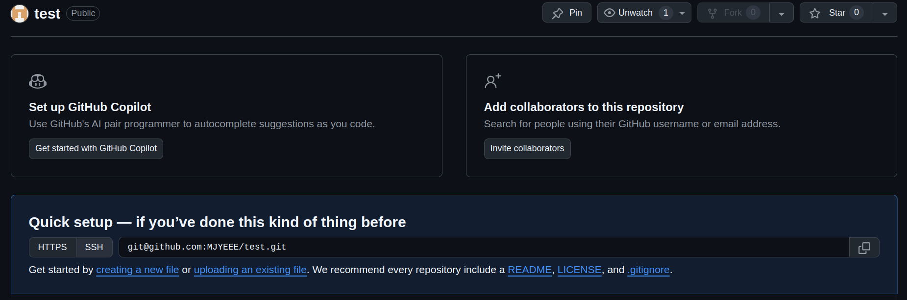
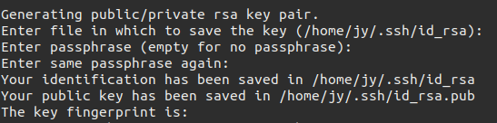
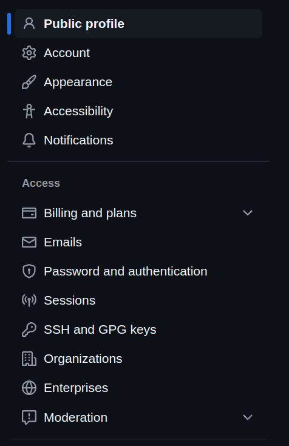
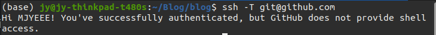
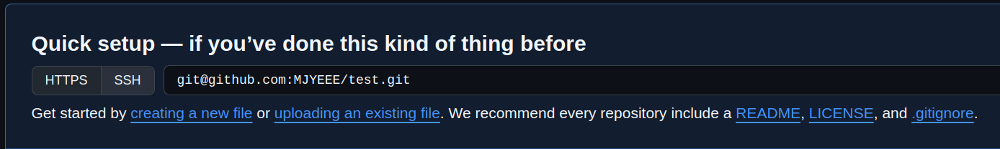

# Github上的git使用
主要介绍本地仓库如何与github仓库建立连接

# 在Github上建立仓库
在我们的仓库repository上新建一个仓库


# 生成SSH KEY：
咱们的本地仓库和GitHub仓库之间的传输是通过SSH加密的，所以我们需要配置验证信息，先生成 SSH Key：
```shell
ssh-keygen -t rsa -C "email@example.com"
```
email@example.com改成你注册github时的邮箱，然后一路回车。


然后进入对应文件夹，我的是在/home/jy/.ssh/下，查看id_rsa.pub
```shell
cd /home/jy/.ssh/
cat id_rsa.pub
```

将输出的id_rsa复制到github下：

先进入settings

然后点击SSH and GPG keys

点击New SSH key，把刚刚生成的key复制进去


为了验证是否成功，输入以下命令：
```shell
ssh -T git@github.com
```
如下，则成功


# 建立连接
在你要创建仓库的地方，创建本地仓库，或者直接使用现成的本地仓库
```shell
git init
```
如果你用的是全新的仓库，先随便往里面加点文件。
将仓库里的文件添加到暂存区,并提交
```shell
git add .
git commit -m "test"
```

现在与你的github仓库建立连接，复制你的仓库链接
```shell
git remote add origin git@github.com:xxxx/xxxx
```


这样本地仓库就与github仓库建立了连接
我们可以查看本地仓库的config
```shell
git config --local --list
```

# 推送仓库
当我们本地仓库提交更新后，我们可以push到github仓库上
```shell
git push origin master
```

