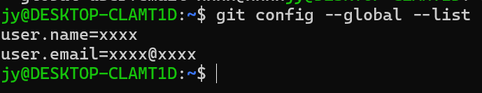

# Git的基本配置
## Config基本介绍
Git仓库可以被多用户的使用，那么怎么区分每个用户就是我们接下来要配置的东西了。
首先输入
```shell
git config --list
```
如果你是刚刚安装的git，你会发现它什么都不会输出。

我们直接输入`git config`，来查看Git的帮助手册
```shell
usage: git config [<options>]

Config file location
    --global              use global config file
    --system              use system config file
    --local               use repository config file
    --worktree            use per-worktree config file
    -f, --file <file>     use given config file
    --blob <blob-id>      read config from given blob object

Action
    --get                 get value: name [value-regex]
    --get-all             get all values: key [value-regex]
    --get-regexp          get values for regexp: name-regex [value-regex]
    --get-urlmatch        get value specific for the URL: section[.var] URL
    --replace-all         replace all matching variables: name value [value_regex]
    --add                 add a new variable: name value
    --unset               remove a variable: name [value-regex]
    --unset-all           remove all matches: name [value-regex]
    --rename-section      rename section: old-name new-name
    --remove-section      remove a section: name
    -l, --list            list all
    -e, --edit            open an editor
    --get-color           find the color configured: slot [default]
    --get-colorbool       find the color setting: slot [stdout-is-tty]

Type
    -t, --type <>         value is given this type
    --bool                value is "true" or "false"
    --int                 value is decimal number
    --bool-or-int         value is --bool or --int
    --path                value is a path (file or directory name)
    --expiry-date         value is an expiry date

Other
    -z, --null            terminate values with NUL byte
    --name-only           show variable names only
    --includes            respect include directives on lookup
    --show-origin         show origin of config (file, standard input, blob, command line)
    --default <value>     with --get, use default value when missing entry
```

我们只看最上面的`Config file location`，配置git的config有3种选择，
- global  用户配置，在当前用户下生效          
- system  系统配置，在当前计算机下生效
- local   仓库配置，在当前仓库下生效          

这三种配置文件，按优先级排序为 local > global > system，也就是说git的配置会按照该顺序来使用。如果你当前用户下只设置了一个配置，那好说，用的就是那个配置；但如果你设置了多个，比如同时设置了local和global，并且你在当前仓库下，则会使用local配置，如果你不在当前仓库下，则还是会使用global配置。

那么如何找到gitconfig的原始文件
```
git config --list --show-origin
```
这样每行配置参数都会显示配置文件的具体路径了


## Config用户配置
我们接下来用global来配置
先来配置用户信息，配置我们个人独特的用户名和邮件地址，可以帮助仓库在每次接受提交代码时记录提交者的信息：
```
git config --global user.name "xxxx"
git config --global user.email xxxx@xxxx
```
现在我们来查看一下：

我们可以看到用户名和邮箱地址就被设置好了，如果说设置完了，发现设错了，我们可能重新设置，或者删除：
```
git config --global --unset user.name "xxxx"
git config --global --unset user.email xxxx@xxxx
```
这样刚才的信息就被删除了。


参考文章:
- <https://git-scm.com/book/zh/v2/%E8%B5%B7%E6%AD%A5-%E5%88%9D%E6%AC%A1%E8%BF%90%E8%A1%8C-Git-%E5%89%8D%E7%9A%84%E9%85%8D%E7%BD%AE>
- <https://www.cnblogs.com/fireporsche/p/9359130.html>