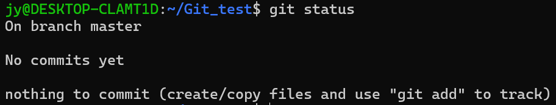
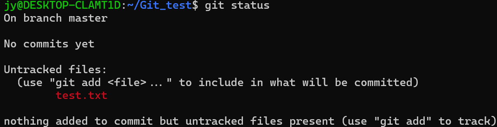
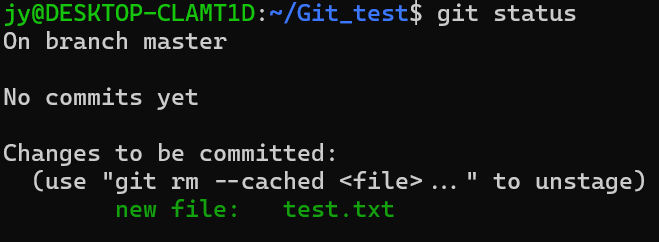

# 本地Git的基本使用
## 创建仓库
进入你想要创建仓库的位置
```shell
mkdir Git_test
cd Git_test
git init
```
在执行完`git init`后，会在该文件夹也就是仓库根目录下，创建一个.git文件，这就是一个仓库的标识。

## 暂存文件
我们先来看一下当前的暂存区状态
```shell
git status
```

然后我们在该仓库新建一个txt文件，并且查看暂存区状态
```shell
vim test.txt # 先按ESC 然后按： 再输入wq 保存退出 
git status
```

这说明我们刚刚添加的文件并没有被追踪，接着将该文件添加到当前仓库的暂存区，并查看当前暂存区状态
```shell
git add test.txt
git status
```

这下我们可以追踪test.txt文件的所有修改状态了

## 提交更改
在修改完暂存区文件后，我们将提交刚刚的修改到本地仓库
```shell
git commit -m "add test.txt"
```
这样我们就将刚刚暂存区里的修改，全部提交到了本地仓库中，并且为这次修改添加提交信息```add test.txt```，用来概括本次修改的内容。


# 远程git仓库的使用
## 克隆仓库
刚刚都是在本地创建的仓库，现在我们可以从现有Git仓库中拷贝一个项目
```shell
git clone xxxx
```
现在我们在当前文件夹下就拷贝了一个项目，我们可以对它进行前面的所有操作。

## 拉取与推送更改
拉取与推送这是远程仓库与本地仓库的不同。
当远程仓库有新的更改时，我们可以拉到我们本地仓库上
```shell
git pull origin master # master可以更改为其他分支 
```
同样的，当你的拉取本地仓库有所更改时，你也可以将更改推送到远程仓库，前提是你已经将更改暂存并且提交
```shell
git push origin master # master可以更改为其他分支 
```

以上都是git的简要操作，更多细节将会在其他文章展示