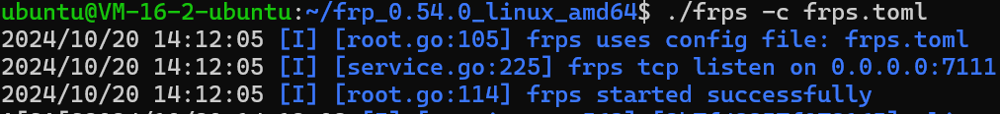
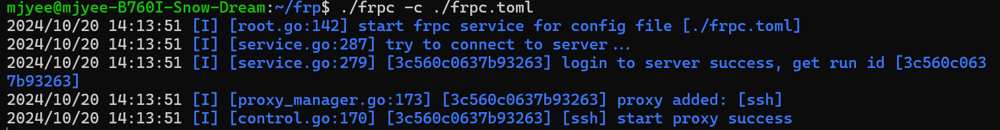

# 实验环境
- 服务机：ubuntu20.04
  - ssh的用户：ubuntu 
- 客户机：ubuntu20.04
  - ssh的用户：mjyee
- 测试机：随便一台电脑
- frp版本：frp_0.54.0_linux_amd64 

# 前排附上官方文档
[官方中文文档](https://gofrp.org/zh-cn/docs/)

# 配置双端
## 服务端
进入到服务端frp目录下，打开frps.toml
```shell
vim frps.toml
```

输入以下内容
```toml
bindPort = 7111
```
就是怎么简单，因为此为最基础的配置，所以就直接这样了

启用服务端
```shell
./frps -c ./frps.toml
```


## 客户端
进入到客户端frp目录下，打开frpc.toml
```shell
vim frpc.toml
```

输入以下内容
```toml
serverAddr = "x.x.x.x" # 你自己的远程服务器IP
serverPort = 7111

[[proxies]] # 代理配置
name = "ssh" # 代理名称
type = "tcp" # 代理类型
localIP = "127.0.0.1" # 被代理的本地服务 IP
localPort = 22 # 被代理的本地服务端口
remotePort = 2222 # 服务端绑定的端口
```

启用客户端
```shell
./frpc -c ./frpc.toml
```


## 连接测试
利用你的测试机
```shell
ssh -p mjyee@x.x.x.x #后跟你自己的远程服务器IP
```

***一定要注意，这里的用户是你客户端的用户，但后面的ip是你的服务端ip。***

**我tm的在这里卡了一天，因为用的是服务端的用户，导致一直卡在输入密码的地方，最后才发现是用户的问题😢**