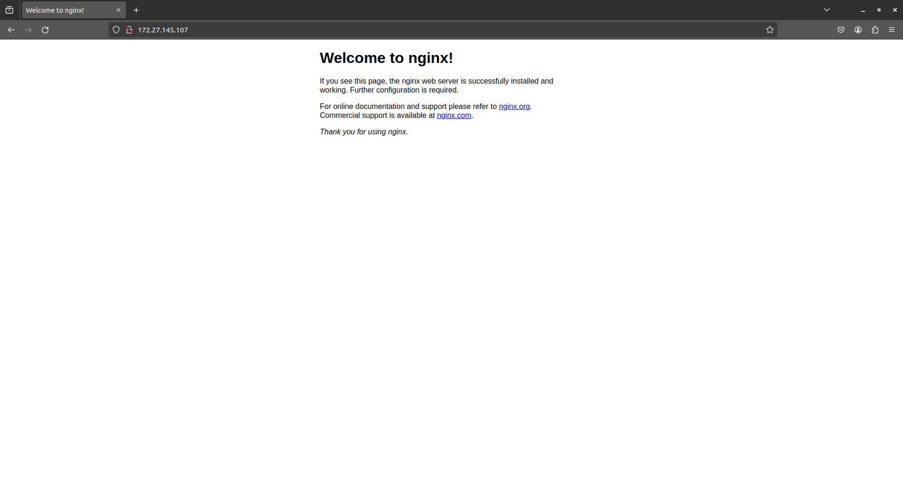
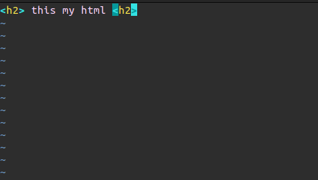
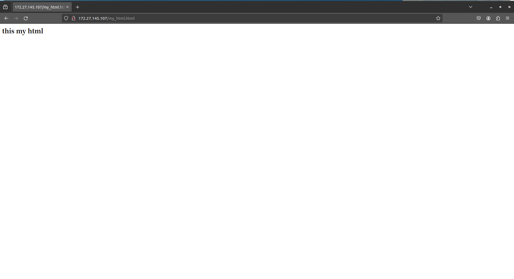

# Nginx的快速上手
---
我们在学习如何编写html之后，只能用自己的浏览器打开，并且还是以文件的方式打开。如果我们想过ip地址来直接访问该怎么办呢？

Nginx就是来解决此问题的。Nginx是一款轻量级的Web服务器、反向代理服务器，由于它的内存占用少，启动极快，高并发能力强，在互联网项目中广泛应用。此篇文章我们不使用它的其他功能，只用来作为Web服务器。
### 安装Nginx环境
---
这里主要介绍的是ubuntu20.04的安装方式，其他Linux系统相似
```
sudo apt install -y nginx 
```
使用apt命令来安装非常方便，

使用`nginx -v`来检查安装成功后的版本号。`nginx -V`可以显示更多信息如编译器版本和配置参数。

想知道Nginx安装到拿去了，输入`whereis nginx`

### 运行Nginx
---
启动Nginx `sudo systemctl start nginx`

输入`ps -ef | grep nginx`可以查看运行中的Nginx 

这个时候我们就可以通过访问自己的ip来查看网页了
可以通过`ifconfig`来查看自己的ip地址


此时显示的是默认的Nginx html，它的位置在`/var/www/html`下

### 更换为自己的网页
---
进入`/var/www/html`下
输入`sudo vim my_html.html`来编写一个简单的html


完成后在浏览器里面输入`x:x:x:x/my_html.html`来浏览刚刚编写的网页


到这里为止，我们的网页边是正式在本地网络上发布了。你可以仿照上面的步骤，来将自己的网页放到自己的网络上，只有别人在相同的网络上，都可以通过ip地址来访问。如果你放在公网上，那么你在外面也可以访问它。

### 停止Nginx服务

当你希望停止Nginx服务时，输入`sudo systemctl stop nginx`即可停止。