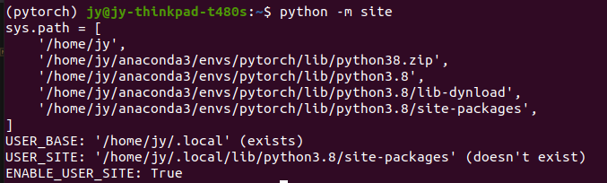
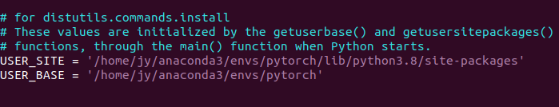
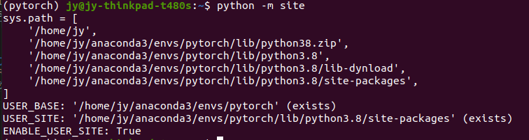

# 使用conda进行python虚拟环境的搭建

## 查看当前conda环境个数
```
conda info --envs
```
## 查看当前用户下有哪些conda环境
```
conda env list
```

## 构建一个新的conda环境
```
conda create -n env_name
```
此时会创建一个与base环境相同的python环境

- 指定python版本
```
conda create -n env_name python==3.8
```
此时会创建一个python3.8版本的python环境

- 指定位置安装（多用于window下防止c盘爆炸，linux没必要）
```
conda create --prefix=D:/envs/pytorch python=3.8
```
此时会在D:/envs/下创建一个名为pytorch的conda环境
**注**：当环境没安装在默认路径下，在conda中不会显示其环境名称，需要用路径来打开

## 打开环境
```
conda activate env_name
```
```
conda activate D:/envs/pytorch
```

## 关闭环境
```
conda deactivate
```

## 删除环境
```
conda remove -n env_name --all
conda remove -p D:/envs/pytorch --all
```

## pip镜像源
- https://pypi.tuna.tsinghua.edu.cn/simple 清华源
- http://pypi.douban.com/ 豆瓣
- http://mirrors.aliyun.com/pypi/simple 阿里云
- http://pypi.hustunique.com/ 华中理工大学
- http://pypi.sdutlinux.org/ 山东理工大学
- http://pypi.mirrors.ustc.edu.cn/ 中国科学技术大学

**注**新版ubuntu要求用https源

不推荐永久修改镜像源，因为可能出问题

---

## 有时候会出现新构建的虚拟环境中通过'pip list’查看时会出现其他的未安装过的包
通过`python -m site`来查看python中的基本路径设置



**原因**:`pip install` 背后实质上是通过 setup.py 来安装python包的，而 setup.py 中用到 setuptools，安装过程中会用到sys.path信息。虽然上面sys.path中的信息包含 envs/pytorch 这个虚拟环境路径。但sys.path中的目录排序是有优先级顺序的（envs/pytorch 路径排在.local后面），再者，当前用户环境目录也是 .local/， 且会最优先用户环境目录进行安装目录的确认;即使用默认的USER_BASE和USER_SITE去使用pip安装，在默认情况路径下可能会存在以前同版本python安装的包，所以会多出来未安转过的包

**解决方法**:找到<your-env>/lib/pythonx.x/site.py，修改对应路径



此时再次查看python中的基本路径设置


这样路径就改好了，以后pip下来的包会默认安装在该路径，而不会与默认路径冲突。

**注**：修改的前提是已经进入虚拟环境，这样修改的是虚拟环境下的配置，而不会影响到全局
修改当前环境下的 site.py 文件

**bug**：经过测试，在ubuntu20.04系统下（其他系统暂时没有尝试），发现不能直接更改conda环境下yourenv/Lib/site.py文件，否则新建的环境系统路径里面会有你改的路径，具体体现就是如果你新建一个环境，改了它的site.py中的USER_SITE和USER_BASE，那么你再新建一个环境，这个环境中的USER_SITE和USER_BASE也是你改的那个！！！这样新环境里面使用pip也能读到上一个环境中安装的库~


参考：
https://blog.csdn.net/weixin_44456692/article/details/122036209
https://blog.csdn.net/chd_lcj/article/details/124943219 ，里面还有另一种方法，我这就不介绍了


---
## linux下有时会出现环境叠加的情况
使用另一个环境的时候发现还是base环境的python。
先退出当前环境`conda deactivate`直到没在任意环境下，在进入想要进入的环境